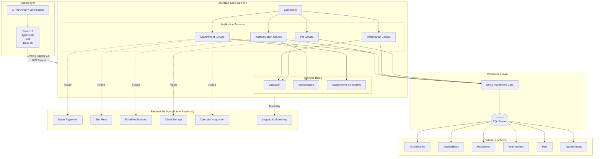

<div align="center">

# 🐾 PawCare

### Production-style Veterinary Appointment Management Platform

**ASP.NET Core &nbsp;•&nbsp; React &nbsp;•&nbsp; TypeScript &nbsp;•&nbsp; PostgreSQL &nbsp;•&nbsp; JWT**

[](https://dotnet.microsoft.com/)
[](https://react.dev/)
[](https://www.typescriptlang.org/)
[](https://www.postgresql.org/)
[](LICENSE)
[]()
[]()

<br/>

> PawCare is a full-stack web application that enables pet owners to register, manage their pets,  
> and book appointments with veterinarians through a clean and responsive interface.  
> Built as a portfolio project to demonstrate production-grade full-stack engineering practices.

<br/>

[Live Demo](#) &nbsp;•&nbsp; [API](#) &nbsp;•&nbsp; [Report Bug](#) &nbsp;•&nbsp; [Request Feature](#)

</div>

---

## 📋 Table of Contents

- [Features](#-features)
- [Demo](#-demo)
- [Screenshots](#-screenshots)
- [Architecture](#-architecture)
- [Tech Stack](#-tech-stack)
- [Getting Started](#-getting-started)
- [Configuration](#-configuration)
- [Demo Credentials](#-demo-credentials)
- [Project Structure](#-project-structure)
- [MVP Workflow](#-mvp-workflow)
- [Roadmap](#-roadmap)
- [Contributing](#-contributing)
- [License](#-license)
- [Author](#-author)

---

## ✨ Features

<table>
<tr>
<td width="50%">

### 🔒 Authentication & Authorization
- JWT-based stateless authentication
- ASP.NET Core Identity
- Role-based authorization (Owner / Vet)
- Secure login & registration
- Protected routes on the frontend

</td>
<td width="50%">

### 🐶 Pet Management
- Add and manage multiple pets
- Full CRUD with owner-scoped access
- Species, breed, age, and weight tracking
- Update and delete with confirmation

</td>
</tr>
<tr>
<td width="50%">

### 🏥 Veterinarian Directory
- Browse available veterinarians
- View specialties and experience
- Consultation fee display
- Clean, filterable listing

</td>
<td width="50%">

### 📅 Appointment Booking
- Book appointments with any veterinarian
- Select from your registered pets
- Future date validation
- Appointment status tracking (Pending / Confirmed / Cancelled)

</td>
</tr>
<tr>
<td width="50%">

### 📊 Dashboard
- Personalized overview on login
- Upcoming appointment summary
- Registered pet summary
- Quick-access navigation

</td>
<td width="50%">

### 🛡 Security
- Passwords hashed via ASP.NET Identity
- JWT expiry and bearer validation
- Server-side ownership checks on all data
- Input validation via FluentValidation

</td>
</tr>
</table>

---

## 🎥 Demo

<!-- walkthrough -->
<video src="https://github.com/user-attachments/assets/dff6146a-b36b-4168-84a7-fd4e2056f51c" width="1280" height="720" controls></video>
---

## 📸 Screenshots

<table>
  <tr>
    <th colspan="6" align="center"><b>Home</b></th>
  </tr>
  <tr>
    <td colspan="6" align="center">
      
    </td>
  </tr>

  <tr>
    <th colspan="3" align="center"><b>Register</b></th>
    <th colspan="3" align="center"><b>Login</b></th>
  </tr>
  <tr>
    <td colspan="3">
      
    </td>
    <td colspan="3">
      
    </td>
  </tr>

  <tr>
    <th colspan="2" align="center"><b>Dashboard</b></th>
    <th colspan="2" align="center"><b>My Appointments</b></th>
    <th colspan="2" align="center"><b>Veterinarian Directory</b></th>
  </tr>
  <tr>
    <td colspan="2">
      
    </td>
    <td colspan="2">
      
    </td>
    <td colspan="2">
      
    </td>
  </tr>

  <tr>
    <th colspan="2" align="center"><b>My Pets</b></th>
    <th colspan="2" align="center"><b>Add Pet</b></th>
    <th colspan="2" align="center"><b>Edit Pet</b></th>
  </tr>
  <tr>
    <td colspan="2">
      
    </td>
    <td colspan="2">
      
    </td>
    <td colspan="2">
      
    </td>
  </tr>
</table>

---

## 🏗 Architecture



---

## 🛠 Tech Stack

### Frontend

| Technology | Purpose |
|---|---|
| React 19 | UI framework |
| TypeScript | Type safety |
| Vite | Build tool & dev server |
| React Router | Client-side routing |
| TanStack Query | Server state & caching |
| React Hook Form + Zod | Form management & validation |
| Tailwind CSS v4 | Utility-first styling |
| shadcn/ui | Component library |
| Axios | HTTP client with JWT interceptor |
| Sonner | Toast notifications |

### Backend

| Technology | Purpose |
|---|---|
| ASP.NET Core (.NET 10) | Web API (Minimal APIs) |
| ASP.NET Core Identity | User management & password hashing |
| Entity Framework Core | ORM |
| Npgsql | PostgreSQL driver |
| JWT Bearer Auth | Stateless authentication |
| FluentValidation | Request input validation |

### Development Tools

- Visual Studio 2022
- Visual Studio Code
- Git & GitHub

---

## 🚀 Getting Started

### Prerequisites

- [.NET SDK 10](https://dotnet.microsoft.com/download)
- [Node.js 22+](https://nodejs.org/)
- [PostgreSQL 16+](https://www.postgresql.org/download/)
- Git

---

### Clone the repository

```bash
git clone https://github.com/asad-au-ullah-portfolio/PawCare.git
cd PawCare
```

---

### Backend

```bash
cd backend

dotnet restore

dotnet ef database update

dotnet run
```

API will be available at:

```
https://localhost:7228
```

---

### Frontend

```bash
cd frontend

npm install

npm run dev
```

Application will be available at:

```
http://localhost:5173
```

---

## ⚙ Configuration

Update `appsettings.json` with your values:

```json
{
  "ConnectionStrings": {
    "DefaultConnection": "Host=localhost;Database=PawCareDb;Username=your_user;Password=your_password"
  },
  "Jwt": {
    "Key": "YOUR_SECRET_KEY",
    "Issuer": "PawCareApi",
    "Audience": "PawCareClient",
    "ExpiryMinutes": 60
  }
}
```

---

## 📂 Project Structure

```
PawCare/
│
├── backend/
│   ├── Features/
│   │   ├── Auth/
│   │   ├── Pets/
│   │   ├── Appointments/
│   │   └── Veterinarians/
│   ├── Entities/
│   ├── Persistence/
│   └── Migrations/
│
├── frontend/
│   ├── src/
│   │   ├── components/
│   │   ├── pages/
│   │   ├── hooks/
│   │   ├── services/
│   │   └── lib/
│   └── public/
│
└── README.md
```

---

## 📌 MVP Workflow

The current MVP supports the complete end-to-end user journey:

```
Register
    ↓
Login
    ↓
Dashboard
    ↓
Add Pet
    ↓
Browse Veterinarians
    ↓
Book Appointment
    ↓
View My Appointments
```

---

## 🛣 Roadmap

### v1.1 — Infrastructure
- [ ] Docker & Docker Compose
- [ ] Cloud deployment (Vercel + Render)
- [ ] CI/CD with GitHub Actions
- [ ] Structured logging (Serilog + Seq)

### v1.2 — Quality
- [ ] Integration tests
- [ ] OpenTelemetry + Grafana
- [ ] Health checks & response caching
- [ ] API documentation (Swagger)

### v2.0 — Features
- [ ] Email notifications & appointment reminders
- [ ] Online payments (Stripe)
- [ ] Real-time video consultations (Jitsi)
- [ ] Medical records & e-prescriptions
- [ ] Reviews & ratings
- [ ] Admin dashboard

---

## 🤝 Contributing

Contributions, suggestions, and feedback are welcome.

1. Fork the repository
2. Create a feature branch (`git checkout -b feature/your-feature`)
3. Commit your changes (`git commit -m 'Add your feature'`)
4. Push to the branch (`git push origin feature/your-feature`)
5. Open a Pull Request

---

## 📄 License

This project is licensed under the [MIT License](LICENSE).

---

## 👨‍💻 Author

**Asadullah Ehsan**

- LinkedIn: *https://www.linkedin.com/in/asadullahehsan/*
- GitHub: [asad-au-ullah-portfolio](https://github.com/asad-au-ullah-portfolio)

---

<div align="center">

If you found this project useful, consider giving it a ⭐

</div>